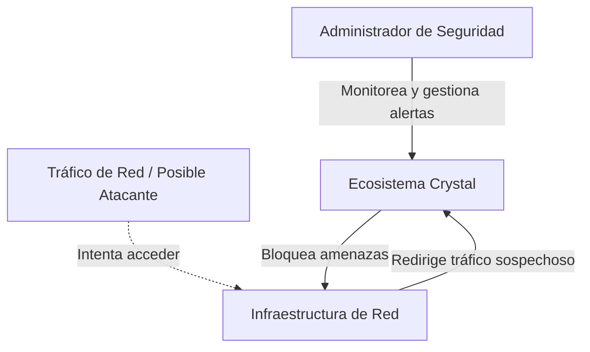
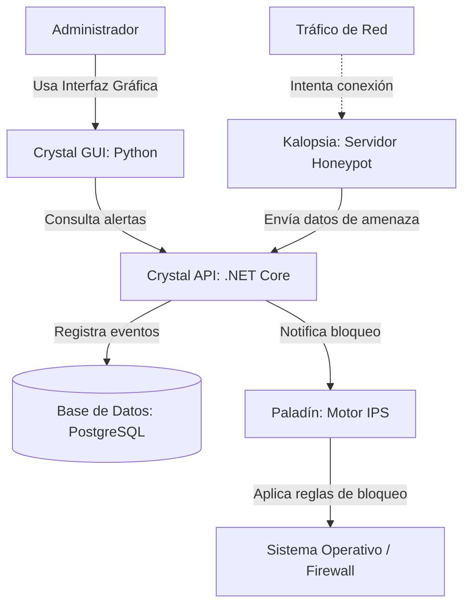

# Arquitectura C4 - Ecosistema de Ciberseguridad Crystal

## C4 Nivel 1 - Contexto
**Para quién es:** Para cualquier persona interesada en la seguridad del sistema, incluyendo usuarios finales, administradores y profesores evaluadores.
**Qué pregunta responde:** ¿Qué es el ecosistema Crystal y quién interactúa con él a gran escala?

---

## C4 Nivel 2 - Contenedores
**Para quién es:** Para el equipo de desarrollo técnico y evaluadores de arquitectura.
**Qué pregunta responde:** ¿Cuáles son los contenedores principales del ecosistema Crystal (módulo sensor, actuador, API, base de datos) y cómo se comunican entre sí?

---
