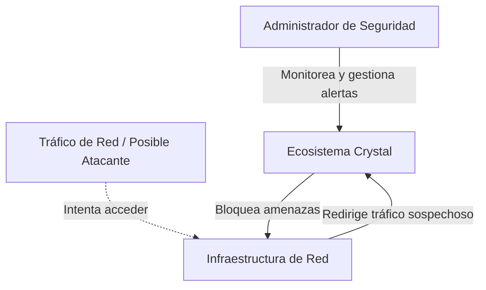
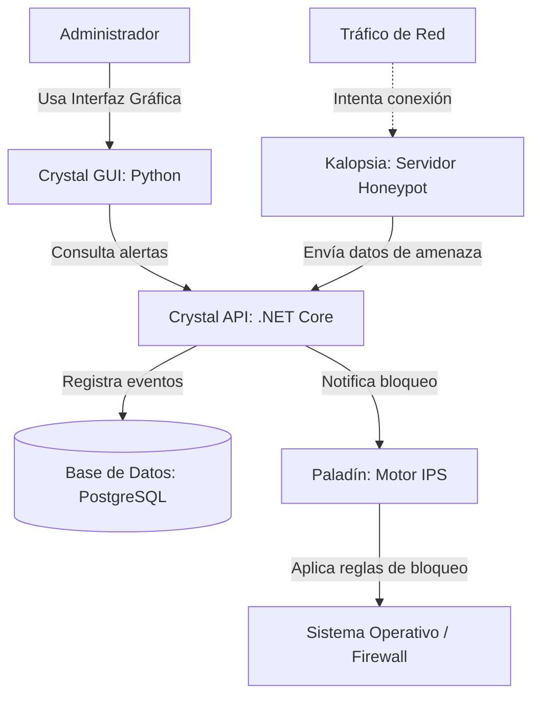
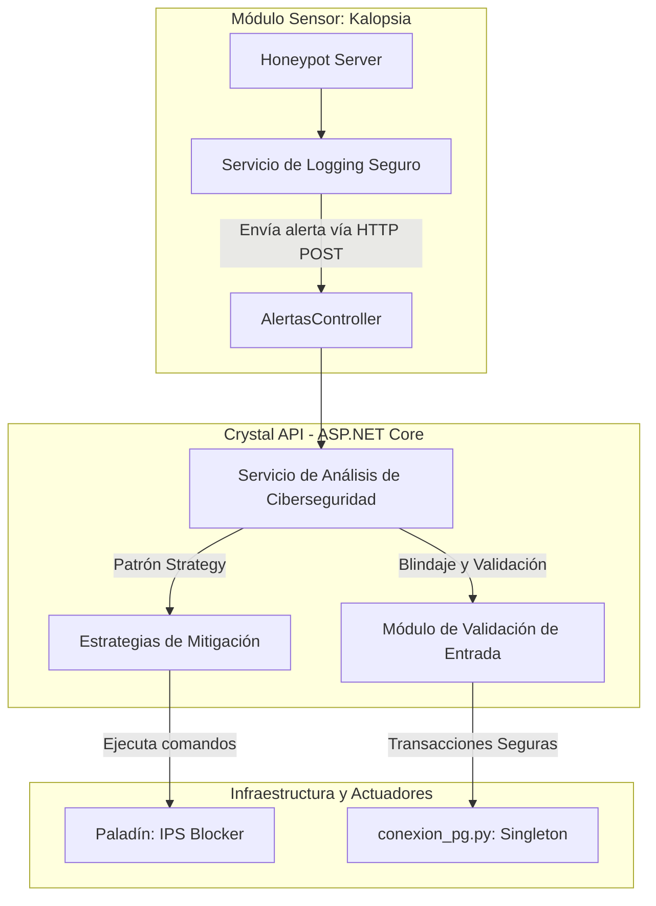

# Arquitectura C4 - Ecosistema de Ciberseguridad Crystal

## C4 Nivel 1 - Contexto
**Para quién es:** Para cualquier persona interesada en la seguridad del sistema, incluyendo usuarios finales, administradores y profesores evaluadores.
**Qué pregunta responde:** ¿Qué es el ecosistema Crystal y quién interactúa con él a gran escala?

---

## C4 Nivel 2 - Contenedores
**Para quién es:** Para el equipo de desarrollo técnico y evaluadores de arquitectura.
**Qué pregunta responde:** ¿Cuáles son los contenedores principales del ecosistema Crystal (módulo sensor, actuador, API, base de datos) y cómo se comunican entre sí?

---

## C4 Nivel 3 - Componentes
**Para quién es:** Para los desarrolladores encargados del mantenimiento, blindaje y mejora del código.
**Qué pregunta responde:** ¿Qué hay dentro de las piezas principales de Crystal y cómo se implementan los patrones de diseño y las medidas de seguridad internas?

---

## Declaración de Uso de IA
Esta documentación ha sido elaborada de manera autónoma, basando la estructura arquitectónica y el diseño de componentes íntegramente en el código fuente de mi autoría (Ecosistema Crystal). Se empleó asistencia de inteligencia artificial (Gemini) de manera exclusiva para la generación técnica de la sintaxis y el renderizado gráfico de los diagramas Mermaid presentados en este documento.